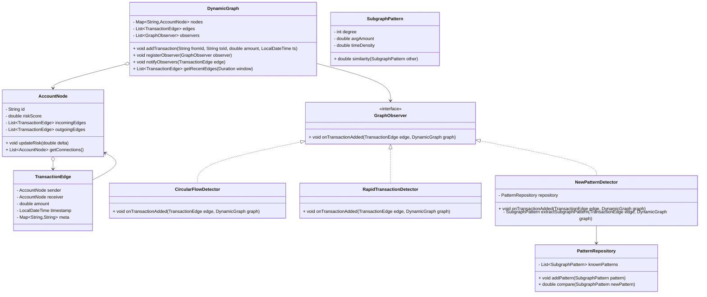
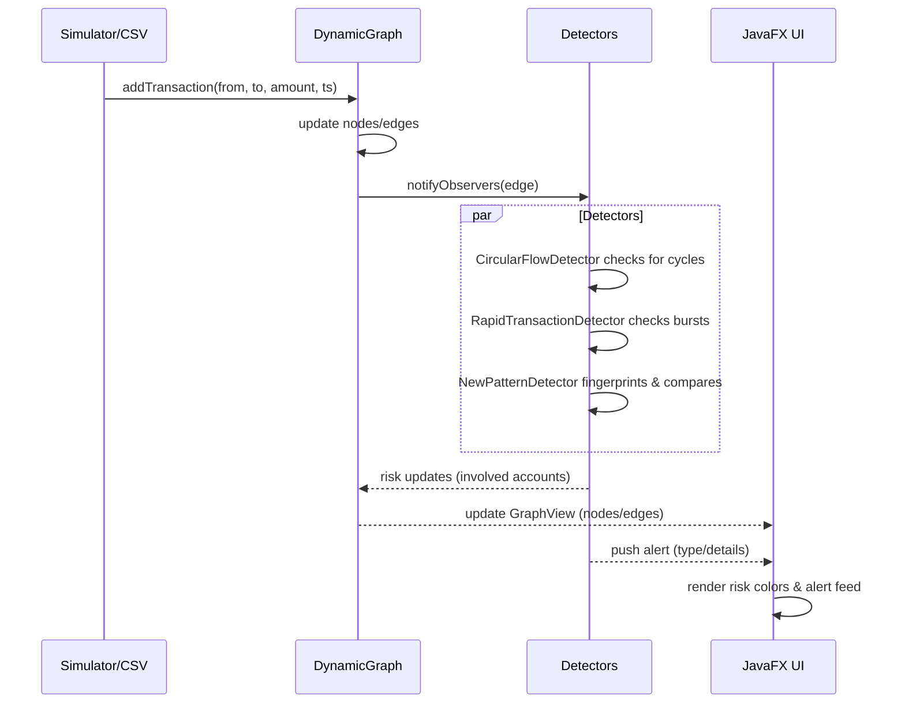

# Architecture

This document describes the system design of the Adaptive Dynamic Graph Engine for Real-Time AML Detection, with Mermaid diagrams that render on GitHub and include color styling.

## System Overview
```mermaid
%% Flowchart with color styling for modules
flowchart LR
    subgraph Data[Data Sources]
      SIM[Simulator]
      CSV[CSV Player]
      API[Free API (optional names)]
    end

    subgraph Engine[Graph Engine]
      DG[DynamicGraph]
      AN[AccountNode]
      TE[TransactionEdge]
    end

    subgraph Detectors[Detectors]
      CFD[CircularFlowDetector]
      RTD[RapidTransactionDetector]
      NPD[NewPatternDetector]
      PR[PatternRepository]
    end

    subgraph UI[JavaFX UI]
      GV[GraphView]
      AP[AlertsPanel]
      CP[ControlsPane]
      SP[StatsPane]
    end

    SIM -->|events| DG
    CSV -->|events| DG
    API -.->|names/metadata| AN

    DG --> CFD
    DG --> RTD
    DG --> NPD
    NPD --> PR

    DG --> GV
    CFD --> AP
    RTD --> AP
    NPD --> AP
    AP --> GV
    CP --> DG
    CP --> CFD
    CP --> RTD
    CP --> NPD
    DG --> SP

    %% Styling
    style Data fill:#a3d5ff,stroke:#1f6feb,stroke-width:2px
    style Engine fill:#b7f5c6,stroke:#1a7f37,stroke-width:2px
    style Detectors fill:#ffd6a5,stroke:#bf5b04,stroke-width:2px
    style UI fill:#d9b3ff,stroke:#7a2fb3,stroke-width:2px

    classDef source fill:#a3d5ff,stroke:#1f6feb,color:#0b1021
    classDef engine fill:#b7f5c6,stroke:#1a7f37,color:#0b1021
    classDef detector fill:#ffd6a5,stroke:#bf5b04,color:#0b1021
    classDef ui fill:#d9b3ff,stroke:#7a2fb3,color:#0b1021

    class SIM,CSV,API source
    class DG,AN,TE engine
    class CFD,RTD,NPD,PR detector
    class GV,AP,CP,SP ui
```

## Class Design


## Event Flow


## Risk Visualization (UI Mapping)
- Node color: risk score gradient (green `#66bb6a` → yellow `#fdd835` → red `#e53935`).
- Edge thickness: proportional to transaction amount.
- Alert badges: detector type color-coded — Circular (orange), Rapid (yellow), Novel (purple).

## Detector Logic (Summary)
- CircularFlowDetector
  - Searches recent edges for cycles A→B→C→A within a time window.
  - Emits alert with path and total flow; increases risk for involved accounts.
- RapidTransactionDetector
  - Detects ping-pong or bursts (K transfers within T or A→B→A patterns).
  - Emits alert with counts and rates; increases risk.
- NewPatternDetector
  - Captures 2-hop neighborhood fingerprint (degree, avg amount, temporal density, recurrence).
  - Compares to `PatternRepository`; flags low-similarity as novel; adapts by adding benign patterns over time.

## Performance & Scaling
- Maintain a time-indexed deque for recent edges to bound detector search.
- Optional pruning: remove or archive old edges beyond UI retention window.
- Use executor services for stream cadence; marshal UI updates via `Platform.runLater`.

## Notes
- Mermaid diagrams render on GitHub automatically. Colors are styled via `style` and `classDef` blocks.
- The diagrams represent planned structure; actual implementation will follow this design.