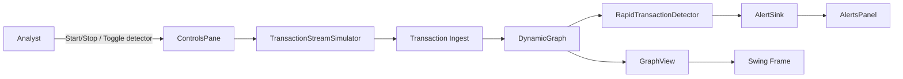
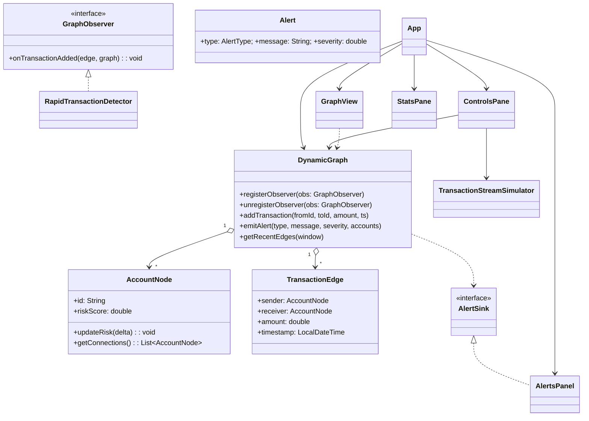

# AML Graph Engine — Project Report (MVP)

## Abstract (100–150 words)

This MVP is a small, real‑time program that shows money moving between accounts as a simple graph. Each account is a dot (node) and each transfer is a line (edge). As new transfers come in, the graph updates live. A single rule watches for quick back‑and‑forth transfers between two accounts (for example A→B and B→A happening several times in a short period). When this happens, the program shows an alert message. The Swing interface is intentionally simple: a live picture of the graph, a list of alerts, and buttons to start/stop the simulator and turn the rule on/off. The goal is to help beginners see how live data can be processed and displayed, without needing prior knowledge of AML or advanced analytics.

## Introduction

- Background and motivation
  - Financial crime often involves patterns across many accounts. Batch analytics can miss fast‑moving behaviors; a streaming graph model offers immediate visibility into suspicious activity.
- Objectives and scope
  - Objective: demonstrate a minimal, comprehensible AML graph system with one detector and a simple UI.
  - Scope: synthetic data stream, rapid‑transfer detection, alerts, and visualization. Advanced detectors and datasets are out of scope for this MVP.

## System Analysis and Design

- Requirement Analysis
  - Functional requirements
    - Ingest transactions from a simulator and update a dynamic graph.
    - Detect quick back‑and‑forth transfers within a time window and show alerts.
    - Visualize graph, show alerts, and provide start/stop and toggle controls.
  - Non‑functional requirements
    - Low‑latency updates and responsive UI.
    - Clear OOP structure and minimal dependencies.
    - Simple to build, run, and extend.

- Use Case Diagram / Flowchart



- Class Diagram



## Implementation

- Engine (core graph model)
  - Purpose: manage accounts (`nodes`), transactions (`edges`), notify observers and UI listeners, and emit alerts.
  - Key lines (`src/main/java/com/oops/aml/engine/DynamicGraph.java`:39–60):
    ```java
    public void addTransaction(String fromId, String toId, double amount, LocalDateTime ts) {
        AccountNode from = getOrCreate(fromId);
        AccountNode to = getOrCreate(toId);
        TransactionEdge edge = new TransactionEdge(from, to, amount, ts, Collections.emptyMap());
        edges.add(edge);
        from.getOutgoingEdges().add(edge);
        to.getIncomingEdges().add(edge);
        from.updateRisk(0.005);
        to.updateRisk(0.005);
        for (GraphObserver obs : observers) { obs.onTransactionAdded(edge, this); }
        for (OnEdgeAddedListener l : edgeListeners) { l.edgeAdded(edge); }
    }
    ```
    - Explanation: creates an edge, updates adjacency lists, nudges risk for visibility, then notifies detectors and the UI.
    - Explanation: `getOrCreate` ensures every ID maps to a single `AccountNode` instance, preventing duplicates and easing neighbor lookups. The small `updateRisk` bump feeds the visualization (green→red) so activity is visible even without alerts. Two notification channels are used: observers (business logic) and edge listeners (UI repaint). This separation keeps detection logic decoupled from presentation.
  - Fields and thread-safety (`src/main/java/com/oops/aml/engine/DynamicGraph.java`:12–17):
    ```java
    private final Map<String, AccountNode> nodes = new HashMap<>();
    private final List<TransactionEdge> edges = new ArrayList<>();
    private final List<GraphObserver> observers = new CopyOnWriteArrayList<>();
    private final List<OnEdgeAddedListener> edgeListeners = new CopyOnWriteArrayList<>();
    ```
    - Explanation: the graph lives in memory for simplicity. `CopyOnWriteArrayList` avoids `ConcurrentModificationException` when detectors register/unregister while iterating; it is efficient for rare writes and frequent reads—ideal for this MVP.
  - Recent window helper (`src/main/java/com/oops/aml/engine/DynamicGraph.java`:74–82):
    ```java
    public List<TransactionEdge> getRecentEdges(Duration window) {
        LocalDateTime cutoff = LocalDateTime.now().minus(window);
        List<TransactionEdge> recent = new ArrayList<>();
        for (int i = edges.size() - 1; i >= 0; i--) {
            TransactionEdge e = edges.get(i);
            if (e.getTimestamp().isBefore(cutoff)) break;
            recent.add(e);
        }
        return recent;
    }
    ```
    - Explanation: walks backward through edges and collects those within a time window for detectors.
    - Explanation: we look from the newest transfers backward and stop when we reach older ones. This makes the check fast because we only scan the recent part we care about.
  - Alert emission (`src/main/java/com/oops/aml/engine/DynamicGraph.java`:93–98):
    ```java
    public void emitAlert(AlertType type, String message, double severity, List<String> accounts) {
        if (alertSink != null) { alertSink.emit(new Alert(type, message, severity, accounts)); }
    }
    ```
    - Explanation: wraps alert creation and forwards it to the UI sink.
    - Explanation: using an `AlertSink` keeps “making alerts” separate from “showing alerts”. Later, alerts could be written to a file or sent over the network without changing the graph code.

- Data types (node and edge)
  - Risk clamping (`src/main/java/com/oops/aml/engine/AccountNode.java`:24–26):
    ```java
    public void updateRisk(double delta) {
        riskScore = Math.max(0.0, Math.min(1.0, riskScore + delta));
    }
    ```
    - Explanation: keeps risk in [0,1] for predictable color mapping.
    - Explanation: keeping the score between 0 and 1 makes coloring easy and avoids odd values.
  - Edge representation (`src/main/java/com/oops/aml/engine/TransactionEdge.java`:41–44):
    ```java
    @Override
    public String toString() {
        return "TX{" + sender.getId() + "->" + receiver.getId() + ", $" + amount + ", " + timestamp + "}";
    }
    ```
    - Explanation: compact log‑friendly view of a transaction.
    - Explanation: a readable text form makes printing and debugging transfers simple.
  - Adjacency convenience (`src/main/java/com/oops/aml/engine/AccountNode.java`:36–44):
    ```java
    public List<AccountNode> getConnections() {
        List<AccountNode> neighbors = new ArrayList<>();
        for (TransactionEdge e : outgoingEdges) { neighbors.add(e.getReceiver()); }
        for (TransactionEdge e : incomingEdges) { neighbors.add(e.getSender()); }
        return neighbors;
    }
    ```
    - Explanation: provides undirected neighbor view for quick local analysis around a node.

- Detector (quick back‑and‑forth)
  - Counting bursts (`src/main/java/com/oops/aml/observers/RapidTransactionDetector.java`:23–31):
    ```java
    List<TransactionEdge> recent = graph.getRecentEdges(window);
    int abCount = 0, baCount = 0;
    for (TransactionEdge e : recent) {
        if (e.getAmount() < minAmount) continue;
        if (e.getSender() == edge.getSender() && e.getReceiver() == edge.getReceiver()) abCount++;
        if (e.getSender() == edge.getReceiver() && e.getReceiver() == edge.getSender()) baCount++;
    }
    ```
    - Explanation: filters by amount, then counts both directions within the window.
    - Explanation: comparing by object identity (`==`) is safe because the graph maintains a single `AccountNode` instance per ID. If using IDs directly, compare strings; here we benefit from the model’s canonical references.
  - Emitting alerts and nudging risk (`src/main/java/com/oops/aml/observers/RapidTransactionDetector.java`:31–38):
    ```java
    if (abCount >= burstCount && baCount >= burstCount) {
        String a = edge.getSender().getId();
        String b = edge.getReceiver().getId();
        String msg = String.format("Quick back-and-forth transfers between %s and %s (>=%d each)", a, b, burstCount);
        graph.emitAlert(AlertType.RAPID_TX, msg, 0.6, List.of(a, b));
        edge.getSender().updateRisk(0.03);
        edge.getReceiver().updateRisk(0.03);
    }
    ```
    - Explanation: raises an alert when both directions exceed the threshold and slightly increases risk for visibility.
    - Explanation: limits (time window, minimum amount, minimum repeats) help avoid false alarms. You can change these values to make alerts more or less sensitive.

- Stream (synthetic transactions)
  - Scheduling and tick (`src/main/java/com/oops/aml/stream/TransactionStreamSimulator.java`:27–31, 38–44):
    ```java
    public void start(long periodMs) {
        if (running) return; running = true;
        scheduler.scheduleAtFixedRate(this::tick, 0, periodMs, TimeUnit.MILLISECONDS);
    }
    private void tick() {
        if (!running) return;
        String from = pickAccount(); String to = pickAccountDifferent(from);
        double amount = 100 + random.nextDouble() * 4900;
        graph.addTransaction(from, to, amount);
    }
    ```
    - Explanation: runs a periodic task to emit transactions; uses a single‑threaded scheduler for simplicity.
    - Explanation: using one background thread keeps things simple and safe. The `running` flag is checked quickly to stop cleanly.
  - Pattern injection (for demo) (`src/main/java/com/oops/aml/stream/TransactionStreamSimulator.java`:56–64):
    ```java
    if (random.nextDouble() < 0.05) {
        String a = pickAccount(); String b = pickAccountDifferent(a);
        double amt = 800 + random.nextDouble() * 2000;
        for (int i = 0; i < 3; i++) { graph.addTransaction(a, b, amt); graph.addTransaction(b, a, amt); }
    }
    ```
    - Explanation: occasionally generates ping‑pong bursts to exercise the detector.
    - Explanation: sometimes the simulator adds a short back‑and‑forth burst on purpose so you can see the alert and confirm the rule works.

- UI (Swing panels)
  - Alert sink updates on EDT (`src/main/java/com/oops/aml/ui/AlertsPanel.java`:22–26):
    ```java
    SwingUtilities.invokeLater(() -> {
        String entry = String.format("[%s] %s | sev=%.2f", alert.getType(), alert.getMessage(), alert.getSeverity());
        model.addElement(entry); list.ensureIndexIsVisible(model.size() - 1);
    });
    ```
    - Explanation: appends alerts safely on the Swing event dispatch thread.
    - Explanation: Swing updates must happen on its main UI thread. `invokeLater` makes sure list updates and repaints happen safely.
  - Custom graph painting (`src/main/java/com/oops/aml/ui/GraphView.java`:63–67, 75–81):
    ```java
    float thickness = (float) Math.min(5.0, 1.0 + e.getAmount() / 5000.0);
    g2.setStroke(new BasicStroke(thickness)); g2.drawLine(sp.x, sp.y, tp.x, tp.y);
    Color c = toRiskColor(node.getRiskScore()); g2.setColor(c); g2.fill(circle);
    g2.drawString(node.getId(), p.x + 6, p.y - 6);
    ```
    - Explanation: maps amount to edge thickness and risk to node color; labels nodes for clarity.
    - Explanation: placing dots around a circle is easy to understand and does not need extra libraries. For small demos, drawing all lines and dots is fast enough.
  - Controls and toggling (`src/main/java/com/oops/aml/ui/ControlsPane.java`:28–44):
    ```java
    JButton start = new JButton("Start Simulator"); JButton stop = new JButton("Stop Simulator");
    JCheckBox cbRapid = new JCheckBox("Enable rapid tx detector", true);
    start.addActionListener(e -> simulator.start(500)); stop.addActionListener(e -> simulator.stop());
    cbRapid.addChangeListener(e -> { boolean enabled = cbRapid.isSelected(); /* register/unregister detector */ });
    ```
    - Explanation: simple controls to drive the simulator and toggle detection.
    - Explanation: the checkbox turns the rule on or off. The panel listens to clicks and tells the graph to add or remove the rule; the panel itself does not do the checking.

- Main concepts used
  - Interfaces: `GraphObserver` and `AlertSink` decouple detection and UI.
  - Concurrency: `ScheduledExecutorService` for streaming cadence; `SwingUtilities.invokeLater` and `Timer` for UI updates.
  - GUI: pure Swing panels; custom painting in `GraphView` keeps visualization simple and dependency‑free.

- Screenshots (placeholders)
  - ``
  - ``
  - ``

## Conclusion & Future Work

- Achievements
  - Built a clear, minimal AML graph MVP with a single rapid‑transfer detector, real‑time alerts, and a simple Swing UI.
- Future enhancements
  - Add a cycle detector (length‑3) and adjustable thresholds.
  - Add CSV playback for real datasets.
  - Persist alerts and export simple reports.

## References

- Oracle Java Swing Tutorial — https://docs.oracle.com/javase/tutorial/uiswing/
- Java Concurrency (ExecutorService) — https://docs.oracle.com/javase/8/docs/api/java/util/concurrent/ExecutorService.html
- Maven Build and Compiler Plugin — https://maven.apache.org/
